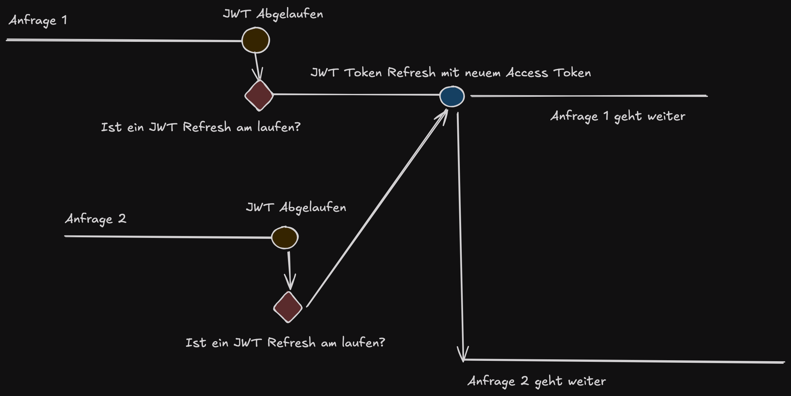

# AngularTodos

## Development server

Run `ng serve` for a dev server. Navigate to `http://localhost:4200/`. The application will automatically reload if you change any of the source files.

## Docker

### Build

```bash
docker build . -t dafnik/angular-todos-web
```

### Run

```bash
docker run -p 127.0.0.1:8080:80 -t dafnik/angular-todos-web
```

## Build

Run `ng build` to build the project. The build artifacts will be stored in the `dist/` directory.

## Library

### Auth Interceptor


